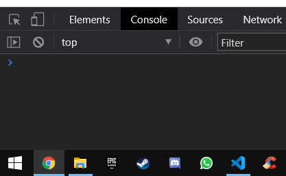
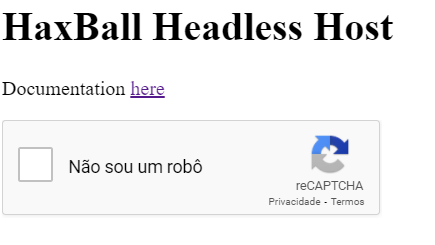

# LambdaHaxball

- Acessar https://www.haxball.com/headless
- Abrir o DevTools e entrar no console

- Selecionar TOP no JavaScript context

- Colar o conteúdo do arquivo script no console e teclar enter

- Responder o captcha e o link da sala será gerado

Site interessante: https://grandesligashaxball.wixsite.com/grandesligashaxball/